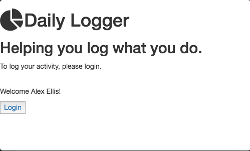

# Daily Logger

This is an app for regularly logging what you've been up to.  It's not meant to give you a minute-accurate view, but instead a rough idea of how you spend your time.

It does so by prompting you for your activity every hour.  One of the main goals is to be as unintrusive as possible.  This is why it lives in the menubar and autohides after activity submission.

## Usage
The current setup is an electron app in `/client-desktop` and a server in `/server`.  To start the app, run `node index.js` in `/server` and in a separate process, run `electron .` in `/client-desktop`.

## TODO:
- Authentication in electron app and server
- Settings (Choose every hour, every half hour, or every 15 minutes, etc)
- Saving to db for user
- Results/review page with graph/day view
- Suggestions for what you're usually doing around this time (from past data)
- Mobile app (probably React Native)
- Custom icon for menubar
- Deploy server (probably heroku) and connect to apps
- ENV variables for endpoint domain
- Notification button for "same activity"
- Optional notification to remind you at a certain time to fill in any blank spots for the day
- Updating past activity
- Break out server into modules
- Add screenshots to README.md for current status of the app after updates
